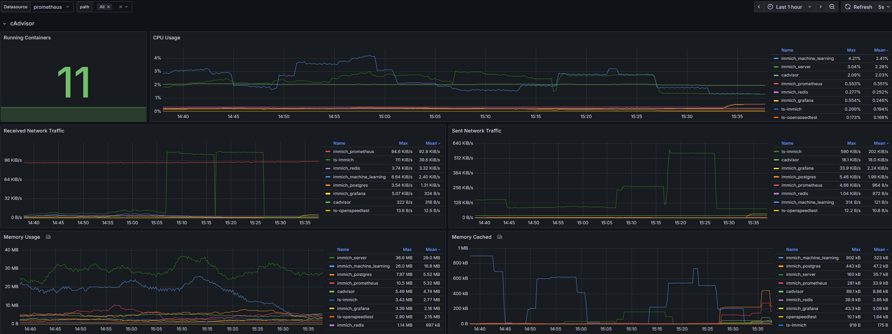

# Introduce:
Immich is a high-performance, open-source, and self-hosted photo/video solution. It's designed to be a direct alternative to cloud services like Google Photos. Allows users to maintain complete control over their digital memories by storing them on their own server, rather than relying on third-party providers
## Key features:
 - Self-Hosting & Privacy
 - Feature-Rich
 - Easy to setup with Docker
 - Support remote machine learning to [offload](https://immich.app/docs/guides/remote-machine-learning/) heavy taskes on a powerful machine with dedicated GPUs and vast memory
 - Very Active Development (⚠️ Expect bugs and breaking changes)
## Project information:
 - Github: https://github.com/immich-app/immich
 - Documentation: https://immich.app/docs/overview/welcome/

### Grafana Dashboard preview

### Immich Server Statistic preview
